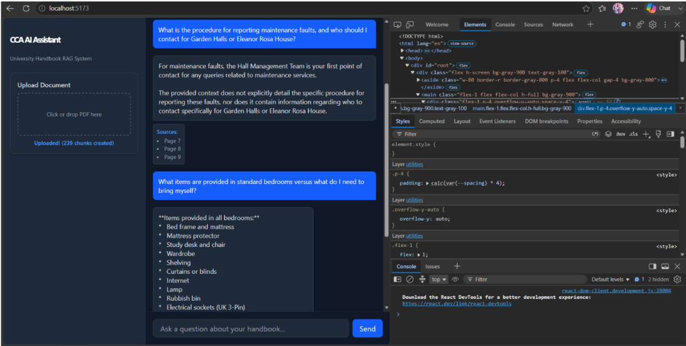
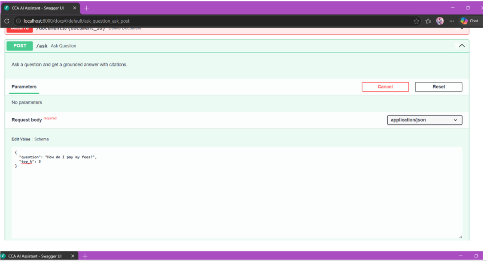
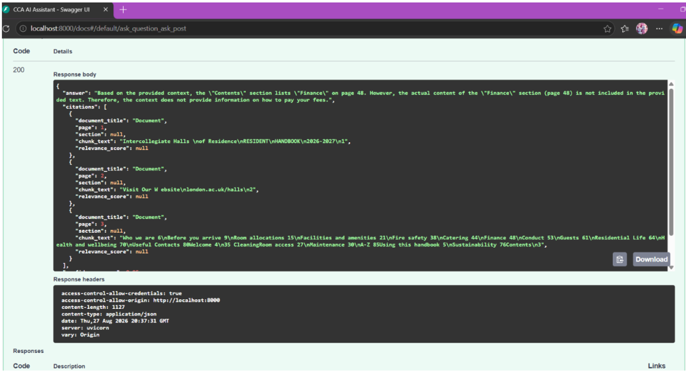

# 🤖 CCA AI Assistant — University Handbook RAG System

[](https://react.dev/)
[](https://fastapi.tiangolo.com/)
[](https://tailwindcss.com/)

An intelligent Retrieval-Augmented Generation (RAG) assistant designed to ingest university handbooks and answer student inquiries with precise page-level citations. Built with FastAPI, LangChain/FAISS vector embeddings, and a React/Vite dashboard interface.

---

## 📌 Table of Contents
- [Overview](#-overview)
- [Architecture](#-architecture)
- [System Architecture & Technical Stack](#-system-architecture--technical-stack)
- [Application Screenshots](#-application-screenshots)
- [Key Features](#-key-features)
- [Tech Stack](#-tech-stack)
- [Getting Started](#-getting-started)
- [License](#-license)

---

## 📖 Overview

Navigating lengthy university handbooks can be time-consuming for students and staff. **CCA AI Assistant** streamlines document search by:
- **Ingesting PDFs**: Extracting and chunking university policy documents into searchable vector embeddings.
- **Semantic Search**: Retrieving relevant document sections using vector similarity search.
- **Precise Citations**: Citing exact page numbers (`Page X`) alongside generated answers for easy verification.
- **Interactive UI**: Providing a responsive dark-mode chat and upload interface.

---

## 📸 Application Screenshots

### 🖥️ React Dark-Mode Chat Interface
Grounded question answering with direct source page citations and document upload panel:



---

### ⚡ FastAPI Swagger Documentation (`/ask` Endpoint)
Interactive API testing showing structured JSON request payload and grounded citation response:

| API Request (`POST /ask`) | API Response & Citations |
|---|---|
|  |  |

---
## 🛠️ Tech Stack

* **Frontend:** React, Vite, Tailwind CSS v4
* **Backend:** Python 3.10+, FastAPI, Uvicorn
* **RAG Engine & Vector DB:** LlamaIndex, PostgreSQL (`pgvector`)
* **DevOps:** Docker, Docker Compose, Git/GitHub

---

## 🚀 Getting Started

### Prerequisites
* **Node.js** (v18+)
* **Python** (v3.10+)


## 🏗️ Architecture

The system uses a two-tier architecture connecting a React frontend to a FastAPI RAG backend:

```text
  ┌────────────────────────┐         POST /ask          ┌────────────────────────┐
  │  React / Vite Frontend │ ─────────────────────────> │    FastAPI Backend     │
  │  (Tailwind CSS v4)     │ <───────────────────────── │   (RAG / Vector DB)    │
  └────────────────────────┘      Answer + Citations    └────────────────────────┘

